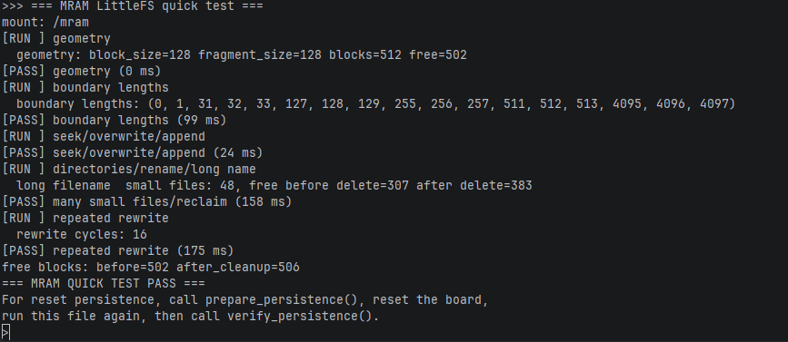
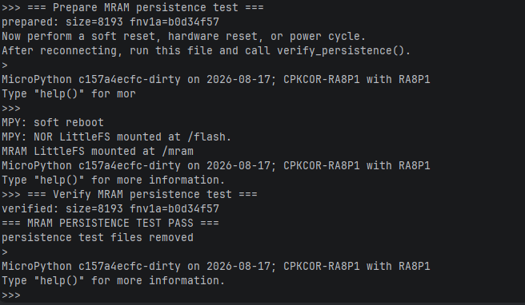

# mram_test.py

## 硬件连接

无

## 运行结果

### 快速测试

注释 `prepare_persistence()` 和 `verify_persistence()`

````python
if __name__ == "__main__":
    run_quick_tests()
    # prepare_persistence()
    # verify_persistence(True)
    pass
````

结果：



### 持久化测试

注释 `run_quick_tests()` 和 `verify_persistence()` 

```python
if __name__ == "__main__":
    # run_quick_tests()
    prepare_persistence()
    # verify_persistence(True)
    pass
```

执行脚本后，注释 `run_quick_tests()` 和 `prepare_persistence()`

```python
if __name__ == "__main__":
    # run_quick_tests()
    # prepare_persistence()
    verify_persistence(True)
    pass
```

对开发板软复位或硬复位或重新上电，执行脚本。结果：



