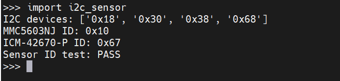
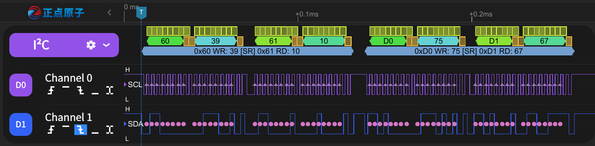

# I2C（IIC）传感器 ID 读取测试

## 板载传感器

| I2C 总线 | 引脚 | 设备 | I2C 地址 |
| --- | --- | --- | --- |
| `I2C(0)` | `P410 / SCL`、`P409 / SDA` | MMC5603NJ 地磁 | `0x30` |
| `I2C(0)` | `P410 / SCL`、`P409 / SDA` | ICM-42670-P 六轴 | `0x68` |


## 运行

复制测试脚本到 `/mram`：

```powershell
python tools\pyboard.py --device COM9 --baudrate 2000000 --wait 5 --filesystem cp ports\renesas-ra8\i2c_sensor.py :/mram/i2c_sensor.py
```

REPL 中运行：

```python
import i2c_sensor
```

测试参数：

- I2C：`I2C(0)`，`400 kHz`
- MMC5603NJ：地址 `0x30`，ID 寄存器 `0x39`，期望值 `0x10`
- ICM-42670-P：地址 `0x68`，ID 寄存器 `0x75`，期望值 `0x67`
- 连续读取：`10` 次

## 测试内容

扫描 I2C 总线，并连续读取两个传感器的 ID 寄存器，检查返回值是否正确。

测试结果：

```text
I2C devices: ['0x18', '0x30', '0x38', '0x68']
MMC5603NJ ID: 0x10
ICM-42670-P ID: 0x67
Sensor ID test: PASS
```



## 逻辑分析仪验证

| 逻辑分析仪 | RA8P1 |
| --- | --- |
| `D0` | `P410 / SCL` |
| `D1` | `P409 / SDA` |
| `GND` | `GND` |

I2C 解码结果：

```text
0x60 WR: 39 [SR] 0x61 RD: 10
0xD0 WR: 75 [SR] 0xD1 RD: 67
```

`[SR]` 为 Repeated START，地磁 ID 为 `0x10`，六轴 ID 为 `0x67`。


