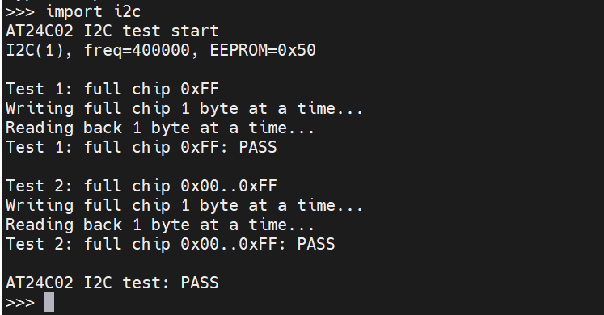

# I2C（IIC）AT24C02 测试

## 硬件连接

| RA8P1 主机 | AT24C02 从机 |
| --- | --- |
| `P512 / SCL` | `SCL` |
| `P511 / SDA` | `SDA` |
| `VSYS_3V3 / 3.3V` | `VCC` |
| `GND` | `GND` |

RA8P1 通过 USB 连接电脑并供电，AT24C02 模块使用开发板 `3.3V` 供电，两者共地。

## 运行方式

将测试脚本复制到板端 `/mram`：

```powershell
python tools\pyboard.py --device COM9 --baudrate 2000000 --wait 5 --filesystem cp ports\renesas-ra8\i2c.py :/mram/i2c.py
```

在 MicroPython REPL 中运行：

```python
import i2c
```

当前测试脚本使用：

```python
EEPROM_ADDR = 0x50
```

`0x50` 为当前实测可正常通信并完成全片读写校验的测试地址。

## 测试内容

AT24C02 按 `256 Byte` 容量进行测试，地址范围为 `0x00 ~ 0xFF`。

读写校验共进行两轮：

1. 全片按 `1 Byte/次` 写入 `0xFF`，然后按 `1 Byte/次` 完整读回并逐地址校验。
2. 全片按 `1 Byte/次` 按地址顺序写入 `0x00 ~ 0xFF`，然后按 `1 Byte/次` 完整读回并逐地址校验。

第二轮中不同地址写入不同数据，可用于检查地址错位、页回卷或部分字节读写异常。

## 第一轮：全片写入 `0xFF`

测试流程：

```text
256 Byte EEPROM
↓
地址 0x00 ~ 0xFF 逐地址写入，每次 1 Byte
↓
每次写入后等待 EEPROM 写周期完成
↓
地址 0x00 ~ 0xFF 逐地址读回，每次 1 Byte
↓
逐地址与 0xFF 比较
```

终端结果：

```text
Test 1: full chip 0xFF
Writing full chip 1 byte at a time...
Reading back 1 byte at a time...
Test 1: full chip 0xFF: PASS
```

测试结果：PASS。

## 第二轮：全片写入 `0x00 ~ 0xFF`

写入数据与 EEPROM 地址对应，每个地址单独写入 1 Byte：

```text
地址 0x00 -> 数据 0x00
地址 0x01 -> 数据 0x01
地址 0x02 -> 数据 0x02
...
地址 0xFE -> 数据 0xFE
地址 0xFF -> 数据 0xFF
```

写完 256 Byte 后，再逐地址读取 1 Byte，并比较实际数据与期望数据。

终端结果：

```text
Test 2: full chip 0x00..0xFF
Writing full chip 1 byte at a time...
Reading back 1 byte at a time...
Test 2: full chip 0x00..0xFF: PASS
```

测试结果：PASS。



## 测试结论

RA8P1 `I2C(1)` 与 AT24C02 模块在 `400 kHz` 条件下，两轮全片单字节读写校验均通过：

- 全片 `0xFF` 写入、读回及逐字节校验：PASS
- 全片 `0x00 ~ 0xFF` 顺序写入、读回及逐字节校验：PASS

最终结果：`AT24C02 I2C test: PASS`。
