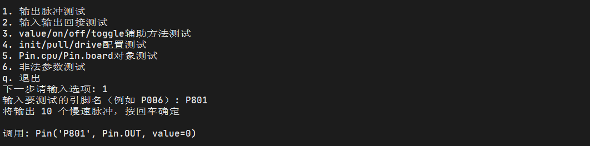
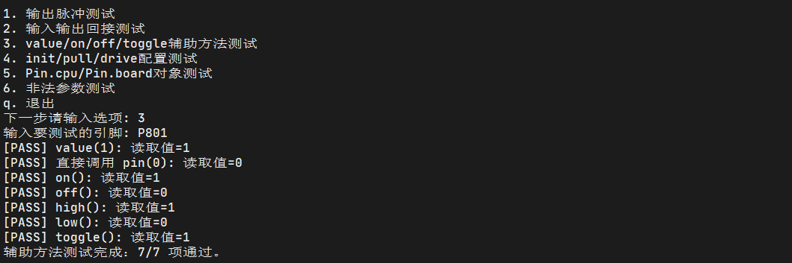
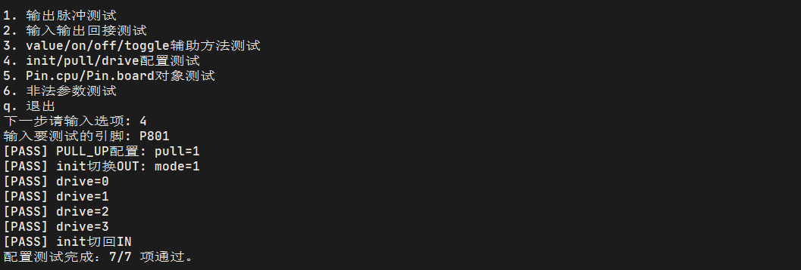
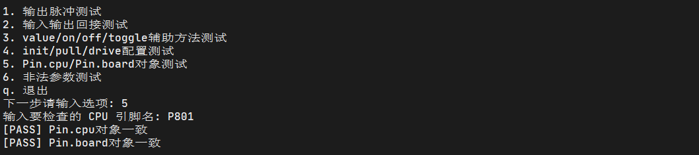
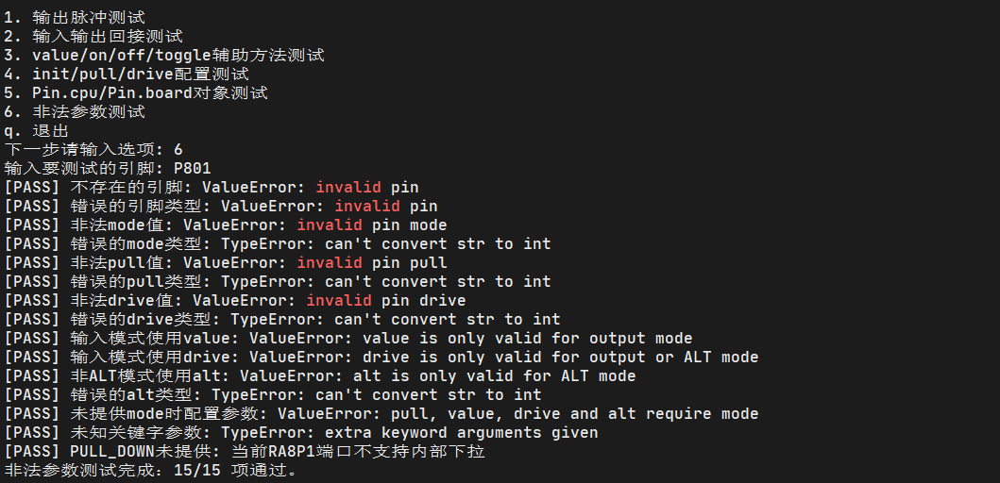

# pin_test.py

此脚本对 Pin 的基本 IO 输入输出功能进行测试。涉及的非标准 API：

- `class machine.Pin()` 
    - `drive([drive])` 
    - `high()` 
    - `init(mode=-1,pull=-1,*,value=None,drive=0,alt=-1)` 
    - `low()` 
    - `mode([mode])` 
    - `off()` 
    - `on()` 
    - `pull([pull])` 
    - `toggle()` 
    - `value([x])` 

## 硬件连接

- 根据交互进行，至少需要一根杜邦线

## 运行结果

### 测试一

示波器波形：

### 测试二

### 测试三

### 测试四

### 测试五

### 测试六

