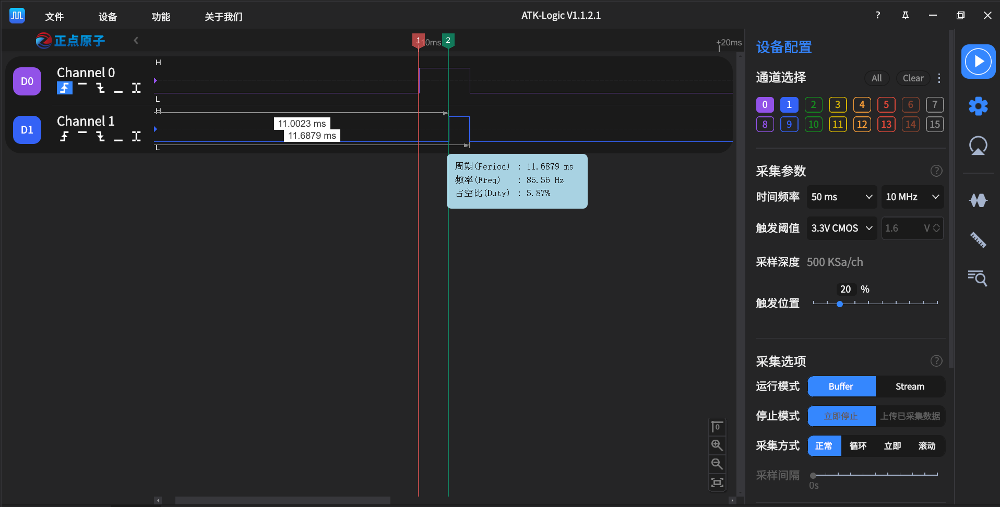

# pin_irq_test.py

## 测试环境

- 开发板：CPKCOR-RA8P1 核心板（RA8P1）
- 固件：MicroPython `25fc4f3692-dirty`，构建日期 `2026-08-25`
- 测试脚本：`Machine/pin_irq_test.py`
- 被测接口：`machine.Pin.irq()`
- 边沿输出引脚：`P000`
- IRQ输入引脚：`P006`
- 软IRQ响应标记引脚：`P001`
- 逻辑分析仪：ATK-Logic V1.1.2.1

## 硬件连接

基础IRQ测试使用一根杜邦线连接：

```text
P000（输出）→ P006（IRQ输入）
```

软IRQ响应延迟测试增加以下连接：

```text
P006 → 逻辑分析仪D0
P001 → 逻辑分析仪D1
开发板GND → 逻辑分析仪GND
```

## 运行方式

将`pin_irq_test.py`上传到开发板文件系统根目录，在MicroPython REPL中执行：

```python
import pin_irq_test
pin_irq_test.main()
```

## 运行结果

### Pin.IRQ_RISING

- 输入：主菜单输入`1`，边沿类型输入`1`，输出引脚输入`P000`，IRQ输入引脚输入`P006`，完成回接后按回车。
- 测试：使用`Pin.irq(handler=handler, trigger=Pin.IRQ_RISING, priority=1, hard=False)`注册软IRQ，产生5个完整脉冲。
- 通过标准：收到5次上升沿回调，回调参数为注册IRQ的Pin对象。
- 结果：`[PASS] 上升沿次数: 期望=5 实际=5`，回调Pin对象检查PASS。

### Pin.IRQ_FALLING

- 输入：主菜单输入`1`，边沿类型输入`2`，输出引脚输入`P000`，IRQ输入引脚输入`P006`，完成回接后按回车。
- 测试：使用`Pin.IRQ_FALLING`注册软IRQ，产生5个完整脉冲。
- 通过标准：收到5次下降沿回调，回调参数为注册IRQ的Pin对象。
- 结果：`[PASS] 下降沿次数: 期望=5 实际=5`，回调Pin对象检查PASS。

### Pin.IRQ_RISING与Pin.IRQ_FALLING双边沿

- 输入：主菜单输入`1`，边沿类型输入`3`，输出引脚输入`P000`，IRQ输入引脚输入`P006`，完成回接后按回车。
- 测试：使用`Pin.IRQ_RISING | Pin.IRQ_FALLING`注册软IRQ，连续产生5个完整脉冲，应产生10次回调。
- 通过标准：C层ISR 10次、Python回调10次、待处理边沿计数溢出0次。
- 结果：C层ISR 10次、Python回调10次、待处理边沿计数溢出0次，结果：PASS。

### handler=None禁用与重新启用IRQ

- 输入：主菜单输入`2`，输出引脚输入`P000`，IRQ输入引脚输入`P006`，完成回接后按回车。
- 测试：注册上升沿回调并触发一次，调用`target.irq(handler=None)`后再次触发，随后重新注册并再次触发。
- 通过标准：禁用期间计数不增加，重新注册后计数继续增加。
- 结果：`[PASS] handler=None禁用: 禁用前=1 禁用后=1`，`[PASS] 重新启用IRQ: 实际=2`。

### hard=True

- 输入：主菜单输入`3`，输出引脚输入`P000`，IRQ输入引脚输入`P006`，完成回接后按回车。
- 测试：使用`Pin.irq(..., trigger=Pin.IRQ_RISING, hard=True)`注册硬中断，使用预分配的`bytearray(1)`计数并产生5个脉冲。
- 通过标准：硬中断计数为5，C层ISR次数为5，Python硬回调成功次数为5，硬回调异常次数为0。
- 结果：`[PASS] 硬中断计数: 期望=5 实际=5`，C层ISR 5次、Python硬回调成功5次、硬回调异常0次，结果：PASS。

### IRQ脉冲计数压力测试

- 输入：主菜单输入`4`，输出引脚输入`P000`，IRQ输入引脚输入`P006`，完成回接后按回车；再输入脉冲次数和半周期毫秒数。
- 测试：使用上升沿软IRQ连续统计指定数量的脉冲。

| 脉冲次数 | 半周期 | 上升沿频率 | 实际计数 | 结果 |
| ---: | ---: | ---: | ---: | --- |
| 10 | 10 ms | 约50 Hz | 10 | PASS |
| 100 | 1 ms | 约500 Hz | 100 | PASS |

### 不支持参数异常测试

- 输入：主菜单输入`6`，IRQ输入引脚输入`P006`，确认该引脚未被外部驱动后按回车。
- 测试：分别传入`Pin.IRQ_HIGH_LEVEL`和`wake=0`。
- 通过标准：前者抛出`ValueError`，后者抛出`NotImplementedError`。
- 结果：`IRQ_HIGH_LEVEL`和`wake`参数均捕获预期异常，`2/2`通过。

### 软IRQ响应延迟

- 输入：主菜单输入`5`，边沿输出引脚输入`P000`，IRQ输入引脚输入`P006`，响应标记引脚输入`P001`；完成回接和逻辑分析仪连接后按回车。
- 测试：D0连接`P006`并使用上升沿触发，D1连接`P001`。P006检测到上升沿后，软IRQ回调将P001拉高。
- 逻辑分析仪：采集时间50 ms、采样率10 MHz、Buffer模式。
- 结果：软IRQ响应标记PASS。D0上升沿为`11.0023 ms`，D1上升沿为`11.6879 ms`，响应延迟为`685.6 μs`。

该时间包含硬件IRQ、MicroPython调度等待和Python回调执行时间，不代表纯硬件中断的最短延迟。



## 当前结论

- 上升沿、下降沿和连续双边沿软IRQ测试均通过。
- `handler=None`能够禁用IRQ，重新注册后能够恢复回调。
- 软IRQ在100个脉冲、约500 Hz输入下计数`100/100`通过。
- `IRQ_HIGH_LEVEL`和`wake`不支持参数能够抛出预期异常。
- 软IRQ响应标记有效，本次测得响应延迟约`685.6 μs`。
- `hard=True`硬中断计数`5/5`通过，C层ISR、Python硬回调次数正确，且未发生硬回调异常。
