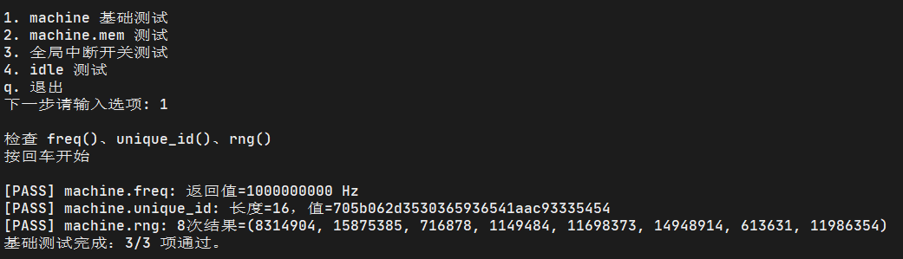
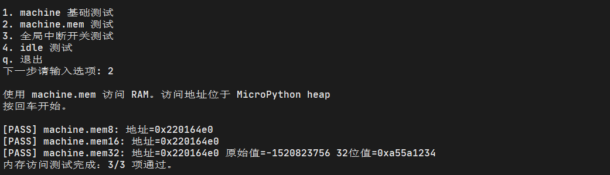
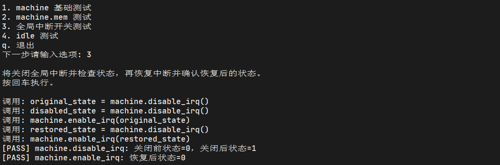
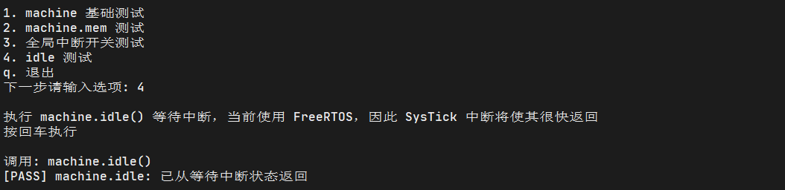
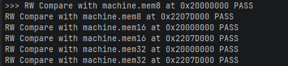
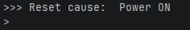
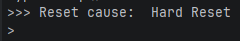
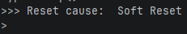

# machine_test.py

此脚本对 machine 模块下的 API 进行综合测试。涉及的非标准 API：

- `machine.disable_irq()` 
- `machine.enable_irq()` 

- `machine.freq()` 
- `machine.mem8` 
- `machine.mem16` 
- `machine.mem32` 
- `machine.rng()` 
- `machine.unique_id()` 

## 硬件连接

无

## 运行结果









# mem_access.py

注意此脚本只能直接在 REPL 执行。此脚本对 Python 层提供的直接内存访问功能进行测试，包括对指定内存区域的读写。涉及非标准 API：

- `machine.mem8` 
- `machine.mem16` 
- `machine.mem32` 

## 硬件连接

无

## 运行结果



## 注意事项

- 测试代码会直接向 `FREE_DTCM`、`FREE_RAM` 进行读写，大小为 `test_size`，当前为 32KBytes。需要确保目标空间未被使用
- 暂时不包含 SDRAM、HyperRAM

# reset.py

注意此脚本只能直接在 REPL 执行。此脚本测试 Python 获取复位原因的 API。涉及的非标准 API：

- `machine.reset_cause()` 

## 硬件连接

无

## 运行结果

重新上电后执行：



按下复位键或在 REPL 执行：

```python
import machine
machine.reset()
```



在终端中按下 Ctrl+D 或在 REPL 执行：

```python
import machie
machine.soft_reset()
```



## 注意事项

- 共有 5 种复位原因：

```python
reson_str = {
    0: "Soft Reset",
    1: "Power ON",
    2: "Hard Reset",
    3: "WDT Reset",
    4: "Deepsleep Reset"
}
```

当前只实现前三种