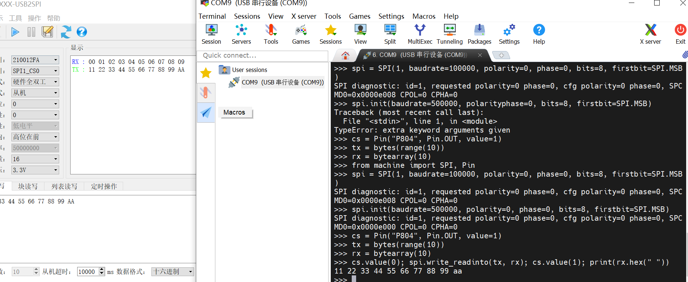
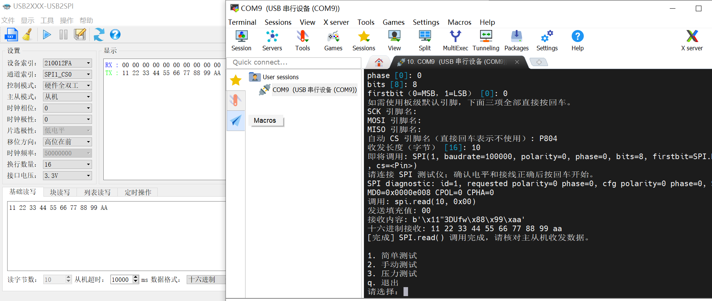
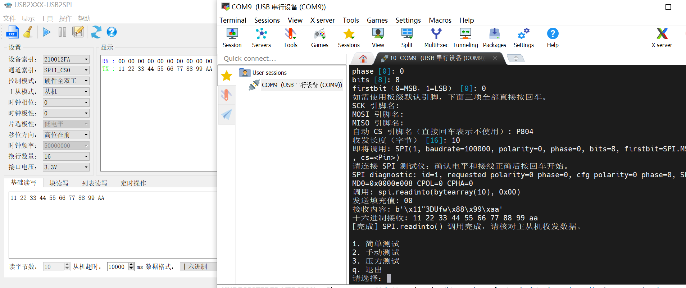
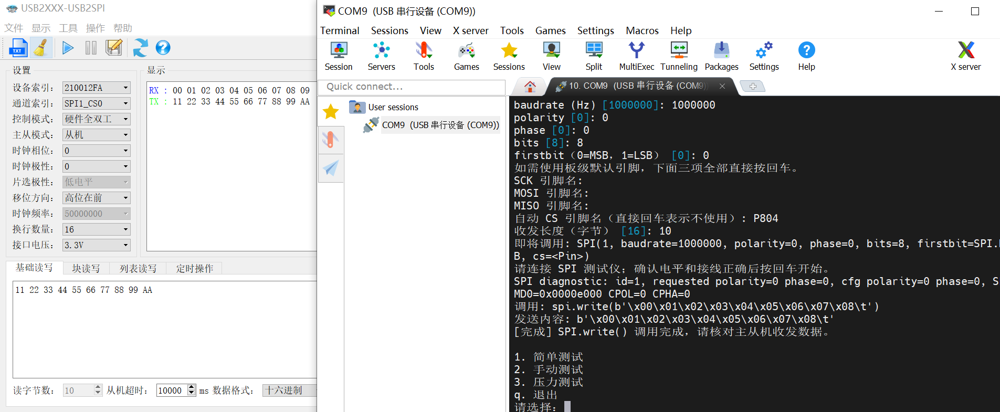
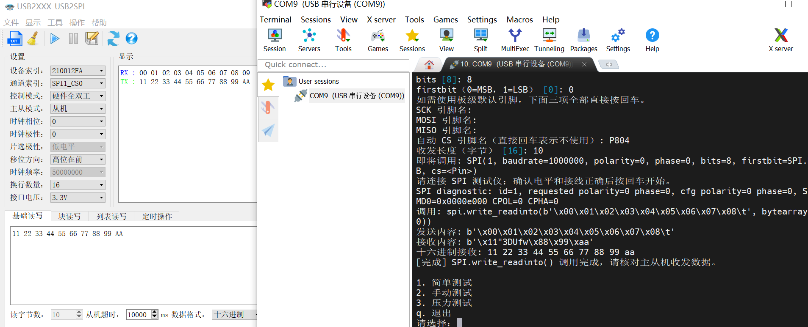
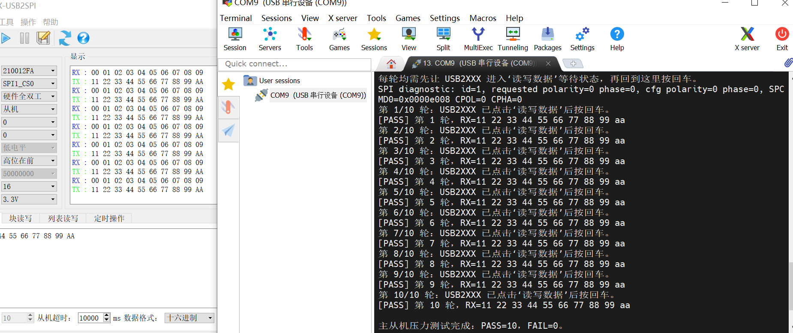
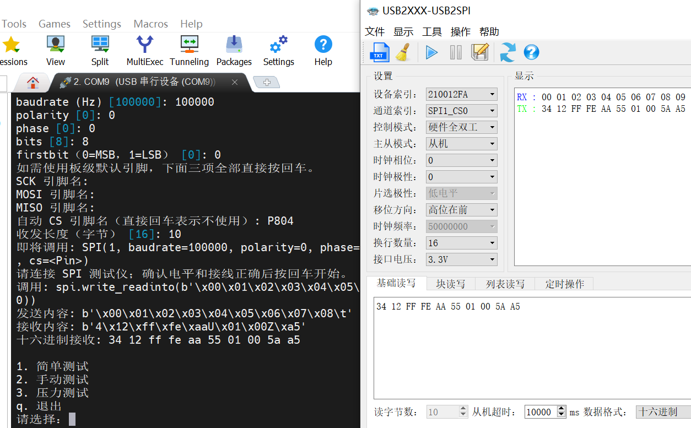
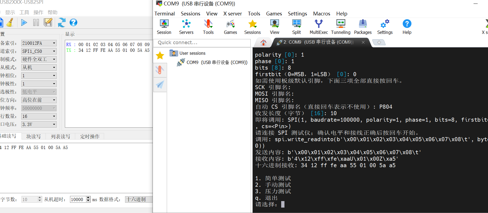

# SPI 主从机测试

## 硬件连接

- 开发板：CPKCOR-RA8P1 核心板（RA8P1）
- 扩展板：CPKEXP-EK8x2
- 主机：RA8P1，使用 `machine.SPI(1)`
- 从机：USB2XXX，使用 `SPI1_CS0`
- 测试脚本：`spi.py`

| RA8P1 主机 | USB2XXX 从机 |
| --- | --- |
| `P804 / CS` | `P13 / SPI1_CS0` |
| `P101 / MOSI` | `P10 / SPI1_MOSI` |
| `P100 / MISO` | `P11 / SPI1_MISO` |
| `P102 / SCK` | `P12 / SPI1_SCK` |
| `GND` | `GND` |

RA8P1 和 USB2XXX 分别通过 USB 连接电脑并供电，两者之间不连接 `5V` 或 `3.3V`，仅连接 SPI 信号线和 GND。

## 运行方式

将测试脚本复制到板端 `/mram`：

```powershell
python tools\pyboard.py --device COM9 --baudrate 2000000 --wait 5 --filesystem cp ports\renesas-ra8\spi.py :/mram/spi.py
```

在 MicroPython REPL 中运行：

```python
import spi
spi.main()
```

USB2XXX 配置如下：

| 配置项 | 设置值 |
| --- | --- |
| 通道 | `SPI1_CS0` |
| 控制模式 | 硬件全双工 |
| 主从模式 | 从机 |
| 时钟极性 | `0` |
| 时钟相位 | `0` |
| 片选极性 | 低电平 |
| 移位方向 | 高位在前 |
| 接口电压 | `3.3V` |
| 读写字节数 | `10` |
| 从机超时 | `10000 ms` |

USB2XXX 从机发送数据设置为：

```text
34 12 FF FE AA 55 01 00 5A A5
```

RA8P1 在测试脚本中选择“手动测试”，参数设置为：

| 参数 | 设置值 |
| --- | --- |
| SPI id | `1` |
| baudrate | `100000` |
| polarity | `0` |
| phase | `0` |
| bits | `8` |
| firstbit | `SPI.MSB` |
| SCK、MOSI、MISO | 使用默认引脚 |
| 自动 CS | `P804` |
| 收发长度 | `10` 字节 |

RA8P1 停在“确认电平和接线正确后按回车开始”时，先在 USB2XXX 软件中点击“读写数据”，再回到 RA8P1 终端按回车开始传输。

## 运行结果

### `machine.SPI()`

测试结果：PASS。

### `machine.SoftSPI()`

Mode 0 通信测试结果：PASS。

### `SPI.init()`

重新配置测试结果：PASS。



### `SPI.deinit()`

测试结果：PASS。

验证流程：deinit 前主从机通信正常；执行 `spi.deinit()` 后，旧实例再次调用 `write_readinto()` 返回 `OSError: [Errno 19] ENODEV`；重新创建 `SPI(1)` 后，主从机通信恢复正常。

### `SPI.read()`

主从机通信测试结果：PASS。



### `SPI.readinto()`

主从机通信测试结果：PASS。



### `SPI.write()`

主从机通信测试结果：PASS。



### `SPI.write_readinto()`

主从机通信测试结果：PASS。



### SPI1 主从机重复通信测试

连续测试 10 次，结果：PASS=10，FAIL=0。



### SPI1 主从机稳定速率测试

测试条件：`SPI(1)`、Mode 0（`polarity=0`、`phase=0`）、`bits=8`、`firstbit=SPI.MSB`、`CS=P804`，每轮收发 10 字节。USB2XXX 作为从机，每轮测试前重新点击一次“读写数据”，随后由 RA8 发起一次 SPI 传输。

| baudrate | 测试结果 | 说明 |
| --- | --- | --- |
| `10000000`（10 MHz） | PASS | 10/10 轮通过 |
| `11000000`（11 MHz） | PASS | 10/10 轮通过 |
| `12000000`（12 MHz） | 不稳定 | 单轮可通过，但重复测试出现 FAIL |
| `12500000`（12.5 MHz）及以上 | FAIL | 收发数据错误 |

SPI1 理论最小 SCK 频率由专用 SPI 的最大分频决定。当前 `SPICLK=250 MHz`，SPI_B 最大分频为 `4096`，因此：

```text
SCK_min = 250000000 / 4096 ≈ 61035 Hz ≈ 61 kHz
```

因此，当前时钟配置下 SPI1 理论最小 SCK 频率约为 `61 kHz`。

#### SCI_B Simple SPI（复用 SPI）理论最大/最小 SCK

复用 SPI 使用 SCI_B 的 Simple SPI 模式。当前工程中 `SCICLK` 由 `PLL2R=480 MHz` 经 `/4` 分频得到，因此输入时钟为：

```text
SCICLK = 480 MHz / 4 = 120 MHz
```

SCI_B Simple SPI 的分频关系为：

```text
Divider = (BRR + 1) × 2^(2 × (CKS + 1) - BGDM)
SCK = SCICLK / Divider
```

其中：

- `BRR` 为 8 位，取值范围 `0~255`。
- `CKS` 为 2 位，取值范围 `0~3`。
- `BGDM` 为 1 位，取值范围 `0~1`。

理论最大 SCK 需要取最小分频。令 `BRR=0`、`CKS=0`、`BGDM=1`：

```text
Divider_min = (0 + 1) × 2^(2 × (0 + 1) - 1)
            = 1 × 2
            = 2

SCK_max = 120000000 / 2
        = 60000000 Hz
        = 60 MHz
```

因此，当前时钟配置下 SCI_B Simple SPI 理论最大 SCK 约为 `60 MHz`。

理论最小 SCK 需要取最大分频。令 `BRR=255`、`CKS=3`、`BGDM=0`：

```text
Divider_max = (255 + 1) × 2^(2 × (3 + 1) - 0)
            = 256 × 256
            = 65536

SCK_min = 120000000 / 65536
        ≈ 1831 Hz
        ≈ 1.83 kHz
```

因此，当前时钟配置下 SCI_B Simple SPI 的理论 SCK 范围约为 `1.83 kHz ~ 60 MHz`。该范围表示 SCI_B Simple SPI 控制器在当前时钟和分频配置下的理论范围，不等同于外接从机后的实际稳定通信范围。

结论：当前 RA8P1 SPI1 + USB2XXX 从机 + 当前接线与 Mode 0 配置下，主从机稳定通信速率上限约为 `11 MHz`；`12 MHz` 已进入不稳定区间。该结果表示当前主从机组合的稳定通信能力，不等同于 RA8P1 SPI1 控制器本身的硬件极限。

SPI1 本地硬件回环最大速度测试结果：

| baudrate | 测试结果 | 说明 |
| --- | --- | --- |
| `62400000`（62.4 MHz） | PASS | 连续 100 轮、每轮 256 字节，PASS=100，FAIL=0 |
| `62500000`（62.5 MHz） | FAIL | 连续 100 轮、每轮 256 字节，PASS=0，FAIL=100 |

结论：当前软件配置、接线和测试条件下，SPI1 本地硬件回环最大稳定请求速率为 `62.4 MHz`；`62.5 MHz` 开始稳定失败。

### SPI1 硬件回环

测试结果：PASS。

- Mode 0（`polarity=0`、`phase=0`）：PASS。
- Mode 1（`polarity=0`、`phase=1`）：PASS。
- Mode 2（`polarity=1`、`phase=0`）：PASS。

回环测试发送 `55 AA 12 34`，接收数据与发送数据一致。

### SPI1 Mode 0 主从机通信

测试结果：PASS。



### SPI1 Mode 1 主从机通信

主从机测试结果：FAIL，收发数据错误。

回环测试结果：PASS，发送 `55 AA 12 34`，接收 `55 AA 12 34`，收发数据一致。

### SPI1 Mode 2 主从机通信

主从机测试结果：FAIL，收发数据错误。

回环测试结果：PASS，发送 `55 AA 12 34`，接收 `55 AA 12 34`，收发数据一致。

### SPI1 Mode 3 主从机通信

测试结果：PASS。



### SPI1 LSB First 主从机通信

测试结果：PASS。

测试条件：`SPI(1)`、Mode 0、`baudrate=1000000`、`bits=8`、`firstbit=SPI.LSB`、`CS=P804`，USB2XXX 从机设置为低位在前。RA8 使用 `write_readinto()` 收发 10 字节，实际接收为 `11 22 33 44 55 66 77 88 99 AA`，与从机发送数据一致。
