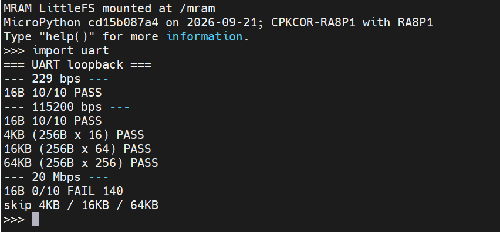

# UART2 回环测试

## 硬件连接

`P801 / TX` 与 `P802 / RX` 直接连接。

## 运行方式

```powershell
python tools\pyboard.py --device COM9 --baudrate 2000000 --wait 5 --filesystem cp ports\renesas-ra8\peripheral\uart.py :/mram/uart.py
```

```python
import uart
```

## 测试内容

### 1. 基础通信

三个波特率均测试 `16B x 10`：

```text
229 bps
115200 bps
20 Mbps
```

每轮：`write 16B -> read 16B -> compare`。

### 2. 连续读写

`115200 bps` 和 `20 Mbps` 基础测试通过后继续测试：

```text
4KB  = 256B x 16 轮
16KB = 256B x 64 轮
64KB = 256B x 256 轮
```

每轮：`write 256B -> read 256B -> compare`。

`229 bps` 不进行大数据量测试，避免耗时过长。

## 测试结果


