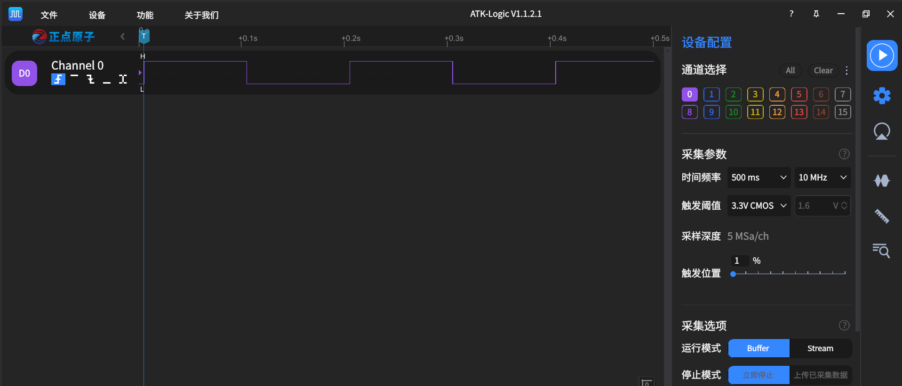

# pin_test.py

## 测试环境

- 开发板：CPKCOR-RA8P1 核心板（RA8P1）
- 测试脚本：`Machine/pin_test.py`
- 被测接口：`machine.Pin`
- 测试引脚：`P006`
- 逻辑分析仪：ATK-Logic V1.1.2.1
- 逻辑分析仪连接：D0接P006，分析仪GND与开发板GND共地

## 运行方式

将`pin_test.py`上传到开发板文件系统根目录，在MicroPython REPL中执行：

```python
import pin_test
pin_test.main()
```

需要清除前一次测试遗留的引脚占用状态时，先执行：

```python
import machine
machine.soft_reset()
```

软复位后重新导入并运行测试脚本。

## 运行结果

### Pin()输出模式

- 输入：主菜单输入 `1`，引脚输入 `P006`，连接逻辑分析仪并共地后按回车。
- 测试：调用 `Pin("P006", Pin.OUT, value=0)`，使用 `on()`和`off()`输出10组高、低各100 ms的脉冲。
- 结果：逻辑分析仪测得高、低电平各约100 ms，周期约200 ms，频率约5 Hz，占空比约50%，结果：PASS。



### Pin()输入模式

- 输入：主菜单输入 `2`，输出引脚输入 `P000`，输入引脚输入 `P006`，使用杜邦线连接 `P000 → P006`后按回车。
- 测试：`P000`按 `0、1、0、1、1、0`输出，使用 `P006.value()`读取对应电平。
- 结果：6次读取均与期望一致，`输入回接测试完成：6/6 项通过`，结果：PASS。

### Pin.value()

- 输入：主菜单输入 `3`，引脚输入 `P006`，确认可安全输出后按回车。
- 测试：调用 `pin.value(1)`写入高电平，再调用 `pin.value()`读回。
- 结果：`[PASS] value(1): 读取值=1`。

### Pin对象直接调用

- 输入：与 `Pin.value()`共用主菜单第 `3` 项。
- 测试：调用 `pin(0)`写入低电平，再使用 `pin.value()`读回。
- 结果：`[PASS] 直接调用 pin(0): 读取值=0`。

### Pin.on()

- 输入：与 `Pin.value()`共用主菜单第 `3` 项。
- 测试：调用 `pin.on()`后读取引脚值。
- 结果：`[PASS] on(): 读取值=1`。

### Pin.off()

- 输入：与 `Pin.value()`共用主菜单第 `3` 项。
- 测试：调用 `pin.off()`后读取引脚值。
- 结果：`[PASS] off(): 读取值=0`。

### Pin.high()

- 输入：与 `Pin.value()`共用主菜单第 `3` 项。
- 测试：调用 `pin.high()`后读取引脚值。
- 结果：`[PASS] high(): 读取值=1`。

### Pin.low()

- 输入：与 `Pin.value()`共用主菜单第 `3` 项。
- 测试：调用 `pin.low()`后读取引脚值。
- 结果：`[PASS] low(): 读取值=0`。

### Pin.toggle()

- 输入：与 `Pin.value()`共用主菜单第 `3` 项。
- 测试：在低电平状态调用 `pin.toggle()`，再读取引脚值。
- 结果：`[PASS] toggle(): 读取值=1`。菜单第3项的7个辅助方法汇总为 `7/7` 通过。

### Pin.init()

- 输入：主菜单输入 `4`，引脚输入 `P006`，断开该引脚上的外部驱动后按回车。
- 测试：先创建 `Pin("P006", Pin.IN, pull=Pin.PULL_UP)`，再调用 `pin.init(Pin.OUT, value=0, drive=Pin.DRIVE_0)`切换为输出模式。
- 结果：同一Pin对象可以从输入模式重新配置为输出模式，结果：PASS。

### Pin.mode()

- 输入：与 `Pin.init()`共用主菜单第 `4` 项。
- 测试：`pin.init(Pin.OUT, ...)`成功后应使用 `pin.mode()`确认输出模式，再切回输入模式并再次确认。
- 结果：能够正确读取重新配置后的输入、输出模式，结果：PASS。

### Pin.pull()

- 输入：与 `Pin.init()`共用主菜单第 `4` 项。
- 测试：使用 `Pin("P006", Pin.IN, pull=Pin.PULL_UP)`配置内部上拉，然后调用 `pin.pull()`读取配置。
- 结果：`[PASS] PULL_UP配置: pull=1`。

### Pin.drive()

- 输入：与 `Pin.init()`共用主菜单第 `4` 项。
- 测试：切换为输出模式后，依次设置并读取 `Pin.DRIVE_0`至`Pin.DRIVE_3`。
- 结果：`Pin.DRIVE_0`至`Pin.DRIVE_3`均能正确设置和读取，结果：PASS。

### Pin.cpu

- 输入：主菜单输入 `5`，引脚输入 `P006`。
- 测试：比较 `Pin.cpu.P006`与直接调用 `Pin("P006")`取得的对象。
- 结果：`[PASS] Pin.cpu对象一致`。

### Pin.board

- 输入：与 `Pin.cpu`共用主菜单第 `5` 项。
- 测试：比较 `Pin.board.P006`与直接调用 `Pin("P006")`取得的对象。
- 结果：`[PASS] Pin.board对象一致`。

### 非法参数

- 输入：主菜单输入 `6`，引脚输入 `P006`，确认该引脚已断开外部设备后按回车。
- 测试：检查非法引脚、错误引脚类型，`mode`、`pull`、`drive`和`alt`的非法值或错误类型，`value`、`drive`和`alt`的非法模式组合，缺少`mode`、未知关键字参数以及`Pin.PULL_DOWN`支持情况。
- 结果：`非法参数测试完成：15/15 项通过`，结果：PASS。

## 当前结论

本轮板端实测确认：

- `P006`能够输出稳定的GPIO高低电平脉冲，实测高、低各约100 ms，周期约200 ms，频率约5 Hz，占空比约50%。
- `P000`输出到`P006`输入的板内GPIO回接测试6/6通过。
- `Pin.value()`、Pin对象直接调用、`on()`、`off()`、`high()`、`low()`和`toggle()`均能正确控制并读取输出状态。
- `Pin.cpu`和`Pin.board`命名空间能够返回与直接构造一致的Pin对象。
- 非法参数测试15/15通过，非法引脚及各类错误参数均能被正确拒绝。
- 当前RA8P1端口不提供内部下拉能力，因此没有`Pin.PULL_DOWN`常量。
- `Pin.init()`可以对同一Pin对象进行重复配置，`Pin.mode()`和`Pin.drive()`测试通过。

## 注意事项

- 测试输出引脚前必须断开该引脚上的其它外部驱动，避免电平冲突。
- 使用逻辑分析仪时必须将分析仪GND与开发板GND共地。
