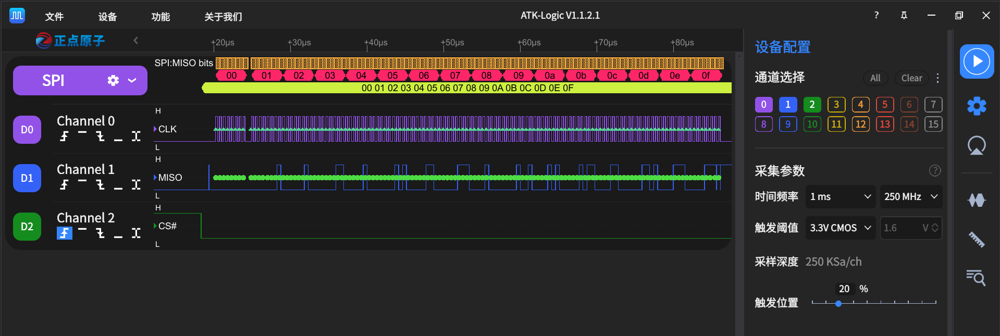

# spi.py

## 测试环境

- 开发板：CPKCOR-RA8P1 核心板（RA8P1）
- 扩展板：CPKEXP-EK8x2
- 测试脚本：`Machine/spi.py`
- 被测接口：`machine.SPI`
- 被测实例：`SPI(3)`
- 默认引脚：`P803=SCK`、`P801=MOSI`、`P802=MISO`

## 硬件连接

### SPI 回环

- `J1000-3 / P801 / MOSI` 与 `J1000-1 / P802 / MISO` 短接。
- `J1000-5 / P803 / SCK` 不参与回环短接。

### 逻辑分析仪

- `D0` 连接 `P803 / SCK`。
- `D1` 连接 `P801/P802` 回环数据节点。
- 逻辑分析仪 `GND` 连接开发板 `GND`。
- SPI 协议解析配置：`CLK=D0`、`MOSI=D1`、`MISO=未设置`、`CS=未设置`、`CPOL=0`、`CPHA=0`、`MSB first`、`8 bits`。

## 运行方式

在 MicroPython REPL 中执行：

```python
import spi
spi.main()
```

菜单包含简单测试、手动测试和压力测试。

## 运行结果

### 简单测试

`SPI(3)` 在 `baudrate=1000000`、`polarity=0`、`phase=0`、`bits=8`、`firstbit=SPI.MSB` 条件下完成回环测试：

| 测试项 | 结果 |
| --- | --- |
| `write_readinto()` | PASS |
| `read()` | PASS |
| `readinto()` | PASS |
| `write()` 返回 `None` | PASS |

简单测试结果：`4/4 PASS`。

### 压力与健壮性测试

生命周期及回环循环次数设置为 20，测试结果为：`PASS=42，FAIL=0`。

已覆盖：

- 反复申请、释放并重复 `deinit()`。
- 多次申请同一个 SPI id。
- 非法 SPI id 和非法参数类型。
- `baudrate`、`polarity`、`phase`、`bits`、`firstbit` 的非法值和边界值。
- 不完整引脚组和不支持的关键字参数。
- 零长度 `write()`、`read()`、`readinto()` 和 `write_readinto()`。
- `read(-1)` 能抛出 `ValueError`，未出现卡死。
- `read(1, 256)` 和 `readinto(bytearray(1), 256)` 能抛出 `ValueError`。
- 只读缓冲区、长度不同的收发缓冲区及非缓冲区参数。
- `deinit()` 后调用传输函数。
- 重复 20 次、每次 256 字节的回环传输，数据保持一致。

### SPI 模式

以下组合均使用 `SPI(3)`、`baudrate=1000000`、`bits=8`、`firstbit=SPI.MSB` 和 16 字节回环数据完成测试，发送内容与接收内容一致：

| SPI Mode | polarity | phase | 结果 |
| --- | ---: | ---: | --- |
| Mode 0 | 0 | 0 | PASS |
| Mode 1 | 0 | 1 | PASS |
| Mode 2 | 1 | 0 | PASS |
| Mode 3 | 1 | 1 | PASS |

### 位序

| 位序 | 测试条件 | 结果 |
| --- | --- | --- |
| `SPI.MSB` | 1 MHz，Mode 0，8 bits，16 字节 | PASS |
| `SPI.LSB` | 1 MHz，Mode 0，8 bits，16 字节 | PASS |

### 频率

| 配置频率 | 测试条件 | 回环结果 |
| ---: | --- | --- |
| 100 kHz | Mode 0，MSB，8 bits，16 字节 | PASS |
| 1 MHz | Mode 0，MSB，8 bits，16 字节 | PASS |
| 2 MHz | Mode 0，MSB，8 bits，16 字节 | PASS |

### 传输长度

| 长度 | 测试条件 | 结果 |
| ---: | --- | --- |
| 1 字节 | 1 MHz，Mode 0，MSB，8 bits | PASS |
| 16 字节 | 1 MHz，Mode 0，MSB，8 bits | PASS |
| 1024 字节 | 1 MHz，Mode 0，MSB，8 bits | PASS |

1024 字节测试数据为 `0x00` 至 `0xff` 循环 4 次，接收内容与发送内容一致，测试过程中未出现异常、卡死或复位。

### 同一缓冲区收发

使用同一个 `bytearray` 作为 `write_readinto()` 的发送缓冲区和接收缓冲区：

```python
buf = bytearray(range(16))
expected = bytes(buf)
spi.write_readinto(buf, buf)
bytes(buf) == expected
```

测试结果为 `True`，回环后的缓冲区内容保持为 `0x00` 至 `0x0f`，结果：PASS。

### SPI.init() 重新配置

先以 1 MHz、Mode 0、MSB 初始化 `SPI(3)`，然后对同一个对象调用 `init()`，重新配置为 2 MHz、Mode 3、LSB。重新配置后完成 8 字节回环传输，发送内容与接收内容一致，结果：PASS。

### 无初始化参数获取现有实例

先将 `SPI(3)` 配置为 2 MHz、Mode 3、8 bits、LSB，再调用不带初始化参数的 `SPI(3)`：

- 两次调用返回同一个对象，`same is s` 为 `True`。
- `baudrate`、`polarity`、`phase`、`bits`、`firstbit`、SCK、MOSI、MISO 和 CS 配置均保持不变。
- 重新获取对象后完成 4 字节回环传输，发送内容与接收内容一致。

测试结果：PASS。

### 显式指定合法引脚组

使用 `sck=Pin("P803")`、`mosi=Pin("P801")` 和 `miso=Pin("P802")` 显式指定 `SPI(3)` 的合法引脚组。初始化后的对象显示引脚配置正确，并完成 8 字节回环传输，发送内容与接收内容一致，结果：PASS。

### 逻辑分析仪

- 1 MHz、Mode 0、MSB、8 bits、16 字节传输能够正确解析为 `00 01 02 03 04 05 06 07 08 09 0a 0b 0c 0d 0e 0f`。
- 2 MHz 时测得 SCK 周期为 500 ns、频率为 2 MHz、占空比为 50%。
- 2 MHz 在 20 MHz 采样率下的协议解析曾出现异常交错数据；将逻辑分析仪采样率提高至 250 MHz，并按 Mode 0、MSB、8 bits 配置协议解析后，16 字节传输能够正确解析为 `00 01 02 03 04 05 06 07 08 09 0a 0b 0c 0d 0e 0f`。



图：`SPI(3)` 在 2 MHz、Mode 0、MSB、8 bits、250 MHz 逻辑分析仪采样率下完成 16 字节回环传输；`P006` 自动 CS 为低电平有效，协议解析结果为 `00` 至 `0f`。

### 自动 CS 时序

使用 `P006` 作为 `SPI(3)` 的自动 CS 引脚，逻辑分析仪连接为 `D0=P803/SCK`、`D1=P801/P802` 回环数据节点、`D2=P006/CS`，在 Mode 0、MSB、8 bits、16 字节条件下完成测试：

- 1 MHz 时，CS 空闲为高，传输开始前拉低，全部 128 个时钟均位于 CS 低电平期间，最后一个时钟结束后 CS 恢复为高；CS 低电平持续时间约为 128 us。
- 2 MHz、250 MHz 逻辑分析仪采样率下，CS 同样完整包围全部时钟；测得 SCK 周期为 512 ns、实际频率为 1.95 MHz、占空比为 49.22%，高、低电平时间分别约为 252 ns 和 260 ns。

自动 CS 时序测试结果：PASS。

## 当前结论

`SPI(3)` 的基础收发、四种 SPI 模式、MSB/LSB 位序、100 kHz 至 2 MHz 的已测频率、1 至 1024 字节的已测长度、同一缓冲区收发、`init()` 重新配置、无初始化参数时保留配置、显式合法引脚组、`P006` 自动 CS 时序以及当前压力测试项目均通过。逻辑分析仪确认 1 MHz 和 2 MHz 数据内容正确，并确认 2 MHz SCK 的实际频率、占空比和自动 CS 时序正确。

## 尚未测试

- `SPI(0)`、`SPI(1)`、`SPI(2)`、`SPI(4)`、`SPI(5)`、`SPI(6)`、`SPI(7)` 的实际硬件回环。
- 与真实 SPI 从设备之间的通信。

## 注意事项

- 当前结论仅适用于已实际测试的 `SPI(3)` 及上述参数组合，不能直接代表其他 SPI id 已通过。
- 回环测试只能验证主机发送、接收和时钟链路，不能替代真实从设备的命令、CS时序及设备协议测试。
- 使用逻辑分析仪时必须将分析仪 GND 与开发板 GND 共地。
